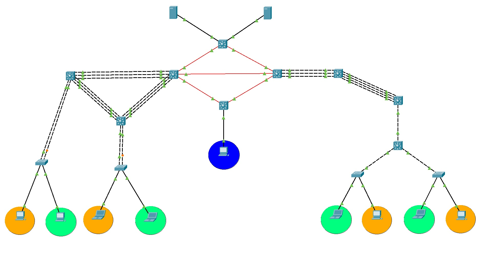
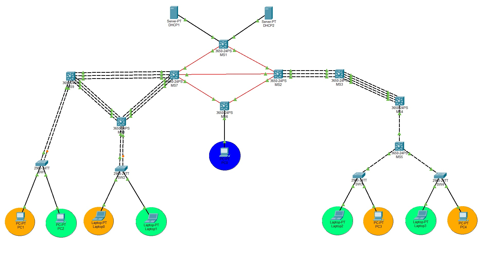
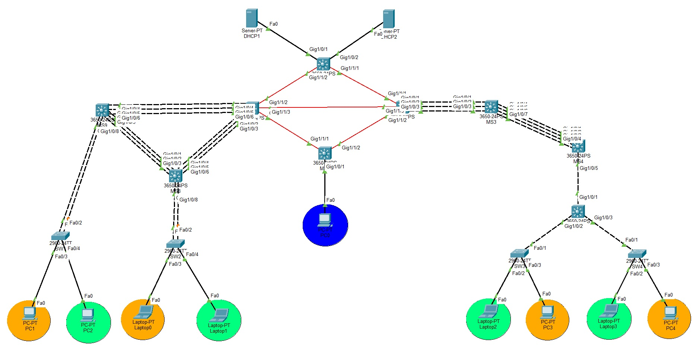

<div align="center">

# Redes de Computadoras 2

**Universidad de San Carlos de Guatemala** · Facultad de Ingeniería · Ingeniería en Sistemas
Segundo Semestre de 2026


</div>

| | |
| :-- | :-- |
| **Estudiante** | Hugo Jorge Luis Pérez Arana |
| **Registro académico** | 201504070 |
| **Catedrático** | Ing. Allan Alberto Morataya Gómez |
| **Auxiliar** | Dominic Juan Pablo Ruano Pérez |
| **Sección** | N |

---

## Descripción

Este repositorio contiene los proyectos y tareas del laboratorio de **Redes de Computadoras 2**, desarrollados en **Cisco Packet Tracer**. El curso se centra en el diseño y la administración de redes empresariales: segmentación, enrutamiento, redundancia, seguridad y verificación de la conectividad.

## Contenido del repositorio

| Entrega | Tema | Documentación | Archivo Packet Tracer |
| :-- | :-- | :-- | :-- |
| **Proyecto 1** | Chapin Red: red corporativa multi-edificio | [README](Proyecto1/README.md) | [`.pkt`](Proyecto1/REDES2_1S2026_201504070.pkt) |
| **Tarea 3** | Redes inalámbricas y redundancia de capa 3 | [Informe PDF](Tarea3/201504070_T3.pdf) | [`.pkt`](Tarea3/201504070_T3.pkt) |

Los enunciados originales están en PDF: [Proyecto 1](Proyecto1/%5BRC2%5DProyecto%201.pdf) y [Tarea 3](Tarea3/975_Tarea_3_2S2026.pdf).

---

## Proyecto 1 · Chapin Red

Diseño e implementación de una **red corporativa en dos edificios** (izquierdo y derecho) más un nodo central, unidos por una red MAN de fibra. El edificio izquierdo sigue una arquitectura jerárquica de tres capas.

<div align="center">
  
</div>

**Qué incluye**

- **Direccionamiento:** subnetting **VLSM** sobre `192.188.70.0/24` para las VLANs y **FLSM /30** sobre `10.4.70.0/24` para los enlaces entre switches multicapa.
- **Capa 2:**
  - **VTP** con switches servidor y cliente.
  - Enlaces **trunk** y puertos de acceso.
  - **EtherChannel:** LACP en el edificio izquierdo y PAgP en el derecho.
  - **STP** con roles de raíz asignados por edificio.
- **Capa 3:** **SVIs** para el enrutamiento entre VLANs y **OSPF** entre edificios.
- **Servicios:** dos servidores **DHCP** con **DHCP Relay** (`ip helper-address`) en las SVIs.
- **Seguridad:** **ACLs** que restringen la comunicación entre las áreas Naranja, Verde y ADMIN.
- **Pruebas:** pings entre áreas y pruebas de tolerancia a fallos en los enlaces LACP y PAgP.

<div align="center">
  
  
</div>

Toda la configuración, las tablas y las capturas están en el [README del Proyecto 1](Proyecto1/README.md).

---

## Tarea 3 · Redes inalámbricas y redundancia de capa 3

Topología con una red inalámbrica básica y redundancia de gateway:

| Elemento | Detalle |
| :-- | :-- |
| **Red** | `192.168.10.0/24` |
| **HSRP** | Grupo 1, IP virtual `192.168.10.1`. R1 activo (prioridad 110, con preempt) y R2 en standby (prioridad 100). |
| **EtherChannel** | `Port-Channel1` con **LACP** (modo `active`) entre SW1 y SW2 por Fa0/23-24. |
| **Wi-Fi** | Access Point con SSID `Redes2_T3_201504070` y seguridad **WPA2-PSK**. |
| **Clientes** | PC, laptop y smartphone. |

El informe con la tabla de direccionamiento, los comandos y las pruebas de verificación está en [`Tarea3/201504070_T3.pdf`](Tarea3/201504070_T3.pdf).

---

## Estructura del repositorio

```
.
├── Proyecto1/   README.md · .pkt · enunciado PDF
├── Tarea3/      informe PDF · .pkt · enunciado PDF
└── img/         capturas de topología y de pruebas del Proyecto 1
```

## Cómo abrir las simulaciones

1. Instalar [Cisco Packet Tracer](https://www.netacad.com/cisco-packet-tracer).
2. Clonar el repositorio:
   ```bash
   git clone https://github.com/hugoarana89/REDES2_2S2026_201504070.git
   ```
3. Abrir el archivo `.pkt` de la entrega que se quiera revisar.

## Herramientas y protocolos

- **Herramienta:** Cisco Packet Tracer.
- **Capa 2:** VLANs, trunking 802.1Q, VTP, STP, EtherChannel (LACP y PAgP) y redes inalámbricas WPA2.
- **Capa 3:** subnetting VLSM y FLSM, SVIs, OSPF, DHCP y DHCP Relay, ACLs y HSRP.
